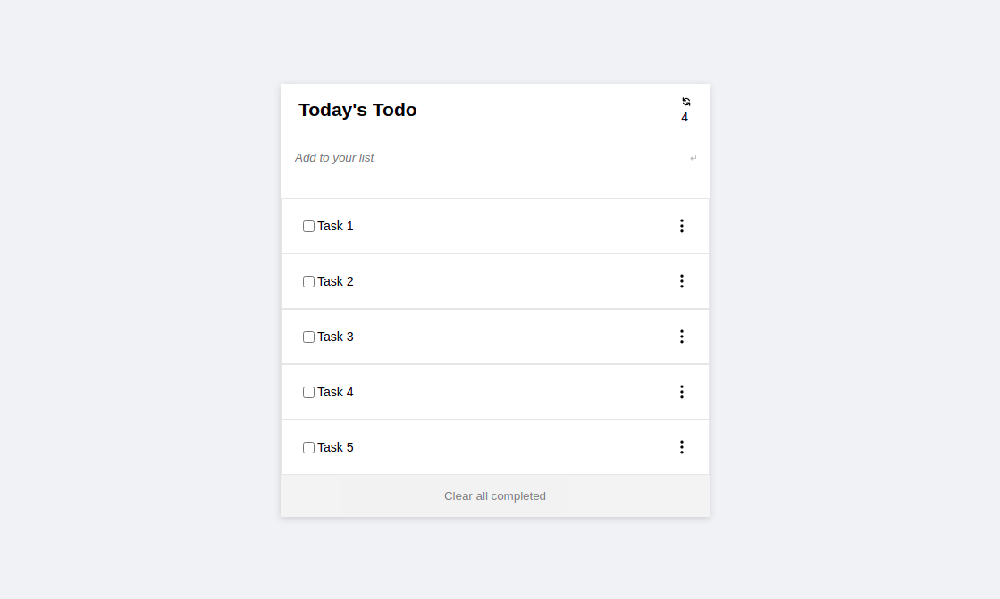

# Todo-List

> Todo-List: Minimalist To-do list website.



### Additional description about the project and its features:
- Adding a new item.
- Removing a selected item.
- Marking a selected item as complete.
- Removing all items marked as complete at once.
- Reordering a selected item (as drag-and-drop) [as an additional feature].
- 
## Built With

- HTML, CSS
- Stylelint, Web Hint, Lighthouse

## Live Demo

[Live Demo Link](https://todo-list-microverse.netlify.app/)

## Getting Started
To get a local copy up and running, follow the steps in Setup below.

### Prerequisites
Basic knowledge of HTML, CSS, and JavaScript.

### Setup
If you installed git you can clone the code to your machine, or download a ZIP of all the files directly.

[Download the ZIP from this location](https://github.com/topeogunleye/todo-list/archive/refs/heads/main.zip), or run the following [git](https://git-scm.com/downloads) command to clone the files to your machine:

```bash
git clone https://github.com/topeogunleye/todo-list.git
```

- Once the files are on your machine, open the _todo-list_ folder in [Visual Studio Code](https://code.visualstudio.com/).

- With the files open in Visual Studio Code, press the **Go Live** button at the bottom of the window to launch the files with [Live Server](https://marketplace.visualstudio.com/items?itemName=ritwickdey.LiveServer).

### Install

The following tools help make easier to work with sample code.

- [git](https://git-scm.com/downloads): A tool for managing source code
- [Visual Studio Code](https://code.visualstudio.com/): A source code editor
- [Live Server](https://marketplace.visualstudio.com/items?itemName=ritwickdey.LiveServer): A simple web server utility for Visual Studio Code

## Authors

👤 **Author1**

- GitHub: [@githubhandle](https://github.com/topeogunleye)
- Twitter: [@twitterhandle](https://twitter.com/topeogunleye21)
- LinkedIn: [LinkedIn](https://linkedin.com/in/ogunleye)

## 🤝 Contributing

Contributions, issues, and feature requests are welcome!

Feel free to check the [issues page](https://github.com/topeogunleye/todo-list/issues).

## Show your support

Give a ⭐️ if you like this project!


## 📝 License

This project is [MIT](./MIT.md) licensed.
